# Venus Library Manager — Architecture & System Diagrams

> Auto-generated architectural documentation for the Hamilton VENUS Library Manager.
> All diagrams use [Mermaid](https://mermaid.js.org/) syntax.

---

## Table of Contents

1. [High-Level System Architecture](#1-high-level-system-architecture)
2. [Data Model & Storage](#2-data-model--storage)
3. [Binary Container Format (.hxlibpkg / .hxlibarch)](#3-binary-container-format)
4. [Creating / Packaging a Library (.hxlibpkg)](#4-creating--packaging-a-library)
5. [Importing / Unpacking a Library (.hxlibpkg)](#5-importing--unpacking-a-library)
6. [Exporting a Library Archive (.hxlibarch)](#6-exporting-a-library-archive)
7. [Importing a Library Archive (.hxlibarch)](#7-importing-a-library-archive)
8. [Library Delete Flow](#8-library-delete-flow)
9. [Version Rollback Flow](#9-version-rollback-flow)
10. [Integrity & Signing Pipeline](#10-integrity--signing-pipeline)
11. [System Library Integrity Verification](#11-system-library-integrity-verification)
12. [Authorization & Access Control](#12-authorization--access-control)
13. [GUI Navigation & Group System](#13-gui-navigation--group-system)
14. [CLI Command Map](#14-cli-command-map)

---

## 1. High-Level System Architecture

```mermaid
graph TB
    subgraph User Interfaces
        GUI["GUI (NW.js Desktop App)<br/>html/index.html + html/js/main.js"]
        CLI["CLI (Node.js)<br/>cli.js"]
    end

    subgraph Shared Core
        SHARED["lib/shared.js<br/>─────────────────<br/>• Container pack/unpack<br/>• Package signing (HMAC-SHA256)<br/>• Zip entry hashing<br/>• Path traversal protection<br/>• Library name validation<br/>• Tag sanitization<br/>• HTML escaping<br/>• HSL metadata footer parser<br/>• File integrity hashing<br/>• GitHub URL validation<br/>• Role-based authorization"]
    end

    subgraph Data Layer
        SETTINGS_DB["db/settings.json<br/>(App Settings)"]
        LINKS_DB["db/links.json<br/>(VENUS Folder Paths)"]
        SYSLIBS_DB["db/system_libraries.json<br/>(System Library Definitions)"]
        SYSHASH_DB["db/system_library_hashes.json<br/>(Integrity Baselines)"]
        INSTALLED_DB["local/installed_libs.json<br/>(Installed Libraries)"]
        GROUPS_DB["local/groups.json<br/>(Custom Groups)"]
        TREE_DB["local/tree.json<br/>(Group ↔ Library Mappings)"]
        UNSIGNED_DB["local/unsigned_libs.json<br/>(Unsigned Libraries)"]
        AUDIT["local/audit_trail.json<br/>(Event History)"]
        PUBLISHER["local/publisher_registry.json<br/>(Known Publishers & Tags)"]
        PKG_STORE["local/LibraryPackages/<br/>(Cached .hxlibpkg Files)"]
    end

    subgraph External
        FS_LIB["VENUS Library Folder<br/>C:\\Program Files (x86)\\HAMILTON\\Library"]
        FS_MET["VENUS Methods Folder<br/>C:\\Program Files (x86)\\HAMILTON\\Methods"]
        REGASM["RegAsm.exe<br/>(COM DLL Registration)"]
        REGISTRY["Windows Registry<br/>(VENUS Version Detection)"]
        WHOAMI["whoami /groups<br/>(Role Authorization)"]
    end

    GUI --> SHARED
    CLI --> SHARED

    GUI --> SETTINGS_DB
    GUI --> LINKS_DB
    GUI --> SYSLIBS_DB
    GUI --> SYSHASH_DB
    GUI --> INSTALLED_DB
    GUI --> GROUPS_DB
    GUI --> TREE_DB
    GUI --> UNSIGNED_DB
    GUI --> AUDIT
    GUI --> PUBLISHER
    GUI --> PKG_STORE

    CLI --> SETTINGS_DB
    CLI --> INSTALLED_DB
    CLI --> GROUPS_DB
    CLI --> TREE_DB
    CLI --> AUDIT
    CLI --> PKG_STORE
    CLI --> SYSLIBS_DB
    CLI --> SYSHASH_DB

    GUI --> FS_LIB
    GUI --> FS_MET
    GUI --> REGASM
    GUI --> REGISTRY

    CLI --> FS_LIB
    CLI --> FS_MET
    CLI --> REGISTRY
    CLI --> WHOAMI

    SHARED --> |AdmZip| FS_LIB
```

---

## 2. Data Model & Storage

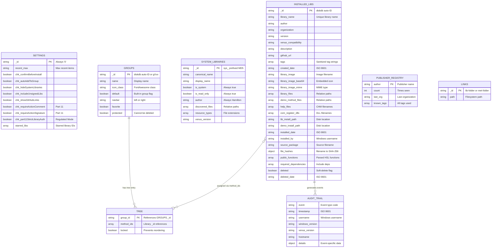

---

## 3. Binary Container Format

The `.hxlibpkg` and `.hxlibarch` files use a custom binary envelope that prevents
standard archive tools from opening them. The inner ZIP payload is XOR-scrambled
and protected by HMAC-SHA256.

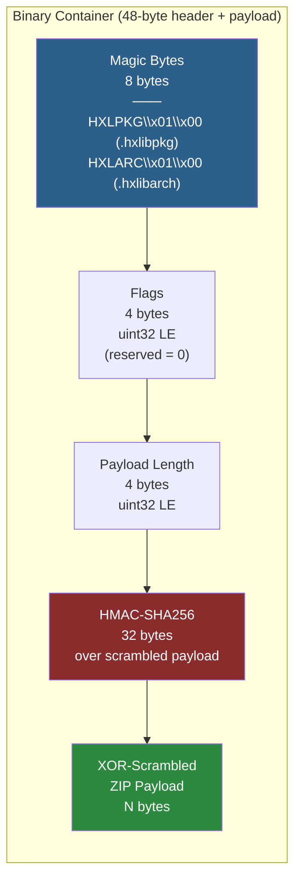

```mermaid
graph TB
    subgraph "Pack (packContainer)"
        ZIP_BUF["Raw ZIP Buffer<br/>(AdmZip.toBuffer())"] --> XOR_ENC["XOR Scramble<br/>32-byte repeating key"]
        XOR_ENC --> HMAC_COMP["Compute HMAC-SHA256<br/>over scrambled bytes"]
        HMAC_COMP --> HEADER["Build 48-byte header<br/>magic + flags + len + hmac"]
        HEADER --> CONCAT["Buffer.concat([header, scrambled])"]
        CONCAT --> CONTAINER["Binary Container File"]
    end

    subgraph "Unpack (unpackContainer)"
        CONTAINER2["Binary Container File"] --> CHECK_MAGIC["Verify magic bytes"]
        CHECK_MAGIC --> READ_HEADER["Read payload length + stored HMAC"]
        READ_HEADER --> VERIFY_HMAC["Recompute HMAC-SHA256<br/>timingSafeEqual comparison"]
        VERIFY_HMAC -->|"Match"| XOR_DEC["XOR De-scramble<br/>same 32-byte key"]
        VERIFY_HMAC -->|"Mismatch"| FAIL["Throw: corrupted or tampered"]
        XOR_DEC --> ZIP_RECOVERED["Recovered ZIP Buffer"]
    end
```

---

## 4. Creating / Packaging a Library

This flow covers building a `.hxlibpkg` from source files — available via the
GUI Packager tool or the CLI `create-package` command.

```mermaid
flowchart TD
    START(["User initiates packaging"]) --> INPUT_SOURCE

    subgraph "Input Collection"
        INPUT_SOURCE{"GUI or CLI?"}
        INPUT_SOURCE -->|"GUI"| GUI_FORM["Fill Package Metadata Form<br/>• Library Name (auto-detect from .hsl)<br/>• Author / Organization / Version<br/>• VENUS Compatibility<br/>• Description / Tags / GitHub URL<br/>• Drag-drop library files<br/>• Drag-drop demo method files<br/>• Library icon image"]
        INPUT_SOURCE -->|"CLI"| CLI_SPEC["Read JSON Spec File<br/>(--spec path.json)<br/>Schema: cli-schema.json"]
    end

    GUI_FORM --> VALIDATE
    CLI_SPEC --> RESOLVE_FILES["Resolve file paths<br/>relative to spec directory"]
    RESOLVE_FILES --> VALIDATE

    subgraph "Validation"
        VALIDATE["Validate Required Fields<br/>• author, version, description<br/>• venus_compatibility<br/>• At least 1 library file"]
        VALIDATE --> CHECK_AUTHOR{"Author = 'Hamilton'<br/>(case-insensitive)?"}
        CHECK_AUTHOR -->|"Yes"| AUTH_PASSWORD["Require author password<br/>(PBKDF2-HMAC-SHA512 check)"]
        CHECK_AUTHOR -->|"No"| CHECK_TAGS
        AUTH_PASSWORD -->|"Valid"| CHECK_TAGS
        AUTH_PASSWORD -->|"Invalid"| ABORT(["Abort: incorrect password"])
        CHECK_TAGS["Sanitize & Validate Tags<br/>• Remove reserved words<br/>• Enforce length limits<br/>• Deduplicate"]
        CHECK_TAGS --> CHECK_NAME["Validate Library Name<br/>• No path separators<br/>• No '..' traversal<br/>• No reserved Windows names"]
    end

    CHECK_NAME --> BUILD_MANIFEST

    subgraph "Package Assembly"
        BUILD_MANIFEST["Build manifest.json<br/>─────────────────<br/>format_version: 1.0<br/>library_name, author, version<br/>created_date (ISO 8601)<br/>library_files[], demo_method_files[]<br/>help_files[], com_register_dlls[]<br/>library_image_base64 (embedded)"]

        BUILD_MANIFEST --> CREATE_ZIP["Create AdmZip Instance"]
        CREATE_ZIP --> ADD_MANIFEST["Add manifest.json"]
        ADD_MANIFEST --> ADD_LIB_FILES["Add library files → library/"]
        ADD_LIB_FILES --> ADD_HELP["Add help files → library/"]
        ADD_HELP --> ADD_DEMO["Add demo methods → demo_methods/"]
        ADD_DEMO --> ADD_ICON["Add icon image → icon/"]
    end

    ADD_ICON --> SIGN

    subgraph "Signing"
        SIGN["signPackageZip(zip)<br/>─────────────────<br/>1. Hash every ZIP entry (SHA-256)<br/>2. Sort file hashes alphabetically<br/>3. JSON.stringify(hashes)<br/>4. HMAC-SHA256 over hash payload<br/>5. Embed signature.json in ZIP"]
    end

    SIGN --> WRAP

    subgraph "Container Wrapping"
        WRAP["packContainer(zip.toBuffer(), MAGIC_PKG)<br/>─────────────────<br/>1. XOR-scramble ZIP bytes<br/>2. Compute HMAC-SHA256<br/>3. Build 48-byte header<br/>4. Concatenate header + scrambled"]
    end

    WRAP --> WRITE_FILE["Write .hxlibpkg to disk"]
    WRITE_FILE --> AUDIT_LOG["Append audit trail entry<br/>event: package_created"]
    AUDIT_LOG --> DONE(["Package Created Successfully"])
```

---

## 5. Importing / Unpacking a Library

This flow covers importing a single `.hxlibpkg` into the VENUS installation.

```mermaid
flowchart TD
    START(["User imports .hxlibpkg"]) --> READ_FILE

    subgraph "File Reading & Unpacking"
        READ_FILE["Read raw file bytes<br/>fs.readFileSync(filePath)"]
        READ_FILE --> UNPACK["unpackContainer(buffer, MAGIC_PKG)<br/>─────────────────<br/>1. Verify magic bytes (HXLPKG)<br/>2. Read header fields<br/>3. Verify HMAC-SHA256 (timing-safe)<br/>4. XOR de-scramble payload"]
        UNPACK -->|"Fail"| ABORT_CORRUPT(["Abort: corrupted/tampered"])
        UNPACK -->|"OK"| PARSE_ZIP["new AdmZip(zipBuffer)"]
    end

    PARSE_ZIP --> READ_MANIFEST["Parse manifest.json<br/>from ZIP"]
    READ_MANIFEST --> VERIFY_SIG

    subgraph "Signature Verification"
        VERIFY_SIG["verifyPackageSignature(zip)<br/>─────────────────<br/>1. Read signature.json<br/>2. Recompute HMAC over stored hashes<br/>3. Compare each file hash to actual"]
        VERIFY_SIG -->|"Valid"| SIG_OK["Signature: VALID"]
        VERIFY_SIG -->|"Failed"| SIG_FAIL{"--force flag?"}
        VERIFY_SIG -->|"Unsigned"| SIG_UNSIGNED["Signature: unsigned (legacy)"]
        SIG_FAIL -->|"Yes"| SIG_WARN["WARNING: importing despite failure"]
        SIG_FAIL -->|"No"| ABORT_SIG(["Abort: signature failed"])
    end

    SIG_OK --> VALIDATE_NAME
    SIG_WARN --> VALIDATE_NAME
    SIG_UNSIGNED --> VALIDATE_NAME

    subgraph "Validation"
        VALIDATE_NAME["Validate library name<br/>(isValidLibraryName)"]
        VALIDATE_NAME --> CHECK_AUTHOR{"Restricted author<br/>'Hamilton'?"}
        CHECK_AUTHOR -->|"Yes + not system lib"| REQUIRE_PW["Require --author-password<br/>or GUI password prompt"]
        CHECK_AUTHOR -->|"No"| CHECK_EXISTING
        REQUIRE_PW -->|"Valid"| CHECK_EXISTING
        CHECK_EXISTING{"Library already<br/>installed?"}
        CHECK_EXISTING -->|"Yes + no --force"| ABORT_EXISTS(["Abort: already installed"])
        CHECK_EXISTING -->|"No / --force"| PREVIEW
    end

    subgraph "Preview (GUI only)"
        PREVIEW["Show Import Preview Modal<br/>─────────────────<br/>• Library metadata<br/>• File list with sizes<br/>• Signature status badge<br/>• Author info<br/>• Confirm / Cancel buttons"]
        PREVIEW -->|"Confirm"| INSTALL
        PREVIEW -->|"Cancel"| ABORT_USER(["User cancelled"])
    end

    subgraph "Installation (installPackage)"
        INSTALL["Sanitize file lists<br/>(safeZipExtractPath)"]
        INSTALL --> MKDIR["Create destination directories<br/>• Library: HAMILTON\\Library\\LibName<br/>• Demo: HAMILTON\\Methods\\Library Demo Methods\\LibName"]
        MKDIR --> EXTRACT["Extract ZIP entries<br/>─────────────────<br/>• library/* → lib dir<br/>• demo_methods/* → demo dir<br/>• help_files/* → lib dir<br/>• Skip manifest.json, signature.json<br/>• Skip icon/ (stays embedded)"]
        EXTRACT --> COM_CHECK{"COM DLLs<br/>declared?"}
        COM_CHECK -->|"Yes (GUI)"| COM_REG["UAC-elevated RegAsm.exe<br/>via PowerShell Start-Process"]
        COM_CHECK -->|"No / CLI"| DB_WRITE
        COM_REG --> DB_WRITE
    end

    subgraph "Database & Indexing"
        DB_WRITE["Upsert DB Record<br/>─────────────────<br/>• Remove existing if overwriting<br/>• Compute file hashes (SHA-256)<br/>• Parse public HSL functions<br/>• Extract #include dependencies<br/>• Save to installed_libs.json"]
        DB_WRITE --> GROUP_ASSIGN["Auto-assign to group<br/>─────────────────<br/>• Hamilton author → gHamilton<br/>• Others → first custom group<br/>• Auto-create 'Libraries' group if none"]
    end

    GROUP_ASSIGN --> CACHE

    subgraph "Post-Install"
        CACHE["Cache .hxlibpkg<br/>to local/LibraryPackages/LibName/<br/>for rollback & repair"]
        CACHE --> AUDIT["Append audit trail entry<br/>event: library_imported"]
        AUDIT --> SUCCESS(["Import Successful<br/>Show success modal (GUI)"])
    end
```

---

## 6. Exporting a Library Archive

This flow covers bundling multiple installed libraries into a `.hxlibarch` file.

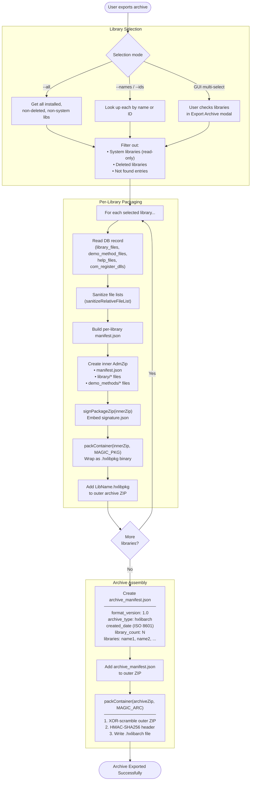

### Archive Internal Structure

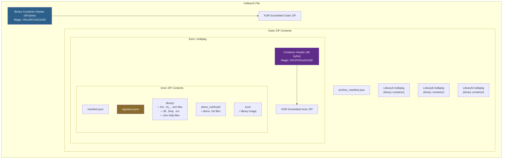

---

## 7. Importing a Library Archive

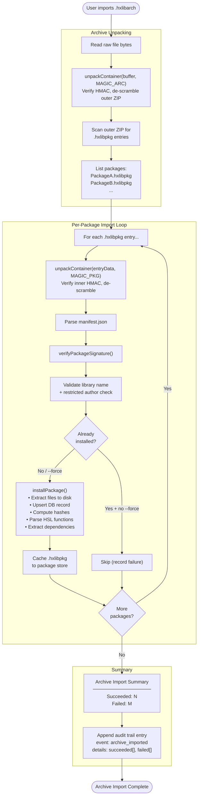

---

## 8. Library Delete Flow

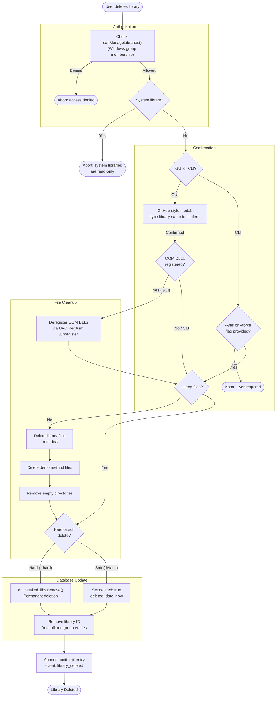

---

## 9. Version Rollback Flow

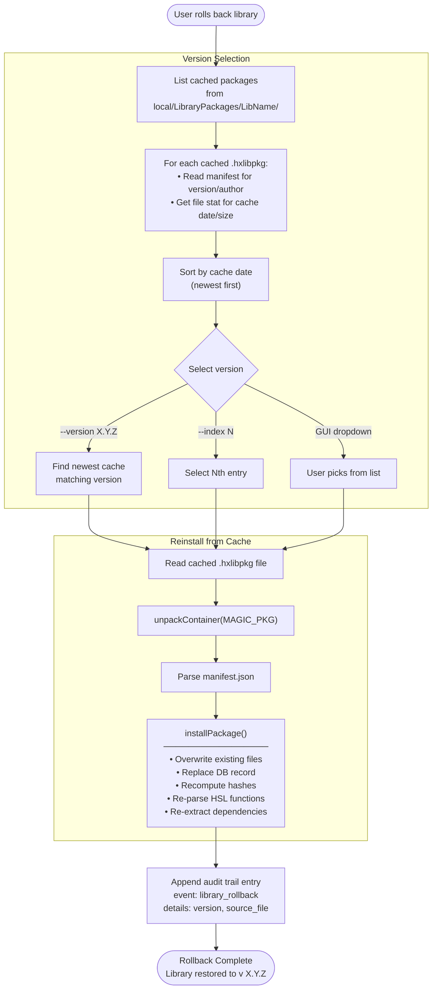

---

## 10. Integrity & Signing Pipeline

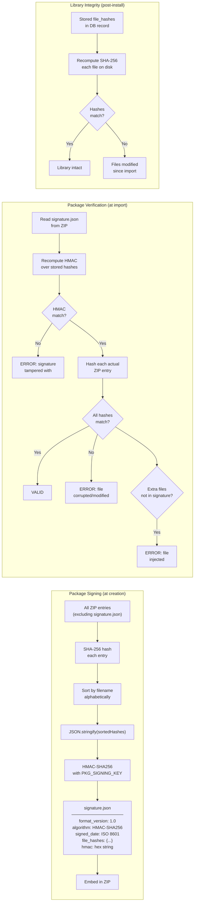

---

## 11. System Library Integrity Verification

```mermaid
flowchart TD
    subgraph "Baseline Generation (generate-syslib-hashes)"
        KNOWN_GOOD["Known-good HAMILTON\\Library folder"]
        KNOWN_GOOD --> SCAN_SYSLIBS["Iterate system_libraries.json<br/>(discovered_files for each lib)"]
        SCAN_SYSLIBS --> FILTER_HSL["Filter to HSL-type files only<br/>(.hsl, .hs_, .smt)"]
        FILTER_HSL --> READ_FOOTER["parseHslMetadataFooter()<br/>Extract: $$valid$$, $$checksum$$,<br/>$$author$$, $$time$$, $$length$$"]
        READ_FOOTER --> STORE_BASELINE["Write system_library_hashes.json<br/>─────────────────<br/>_meta: strategy: hamilton-footer<br/>libraries:<br/>  LibName:<br/>    files:<br/>      file.hsl: valid, checksum, author"]
    end

    subgraph "Verification (verify-syslib-hashes)"
        LOAD_BASELINE["Load system_library_hashes.json"]
        LOAD_BASELINE --> VERIFY_LOOP["For each baselined file..."]
        VERIFY_LOOP --> CHECK_EXISTS{"File exists<br/>on disk?"}
        CHECK_EXISTS -->|"No"| MISSING["MISSING"]
        CHECK_EXISTS -->|"Yes"| PARSE_CURRENT["parseHslMetadataFooter()<br/>on current file"]
        PARSE_CURRENT --> CHECK_FOOTER{"Footer<br/>present?"}
        CHECK_FOOTER -->|"No + was valid=1"| REMOVED["TAMPERED:<br/>footer removed"]
        CHECK_FOOTER -->|"Yes"| CHECK_VALID{"valid flag<br/>changed 1 to 0?"}
        CHECK_VALID -->|"Yes"| FLAG_CHANGED["TAMPERED:<br/>valid flag changed"]
        CHECK_VALID -->|"No"| CHECK_CHECKSUM{"Checksum<br/>matches baseline?"}
        CHECK_CHECKSUM -->|"Yes"| OK["OK"]
        CHECK_CHECKSUM -->|"No"| CHECKSUM_CHANGED["TAMPERED:<br/>checksum changed"]
    end

    subgraph "Background Worker (syscheck-worker.js)"
        WORKER["Child process runs<br/>integrity checks at startup"]
        WORKER --> IPC_SEND["IPC message:<br/>integrityResults,<br/>missingPackages,<br/>backupsNeeded"]
        IPC_SEND --> MAIN_THREAD["Main thread processes results<br/>• Show warnings in UI<br/>• Trigger repair prompts"]
    end
```

---

## 12. Authorization & Access Control

```mermaid
flowchart TD
    subgraph "Role-Based Access (Windows Groups)"
        ACTION["Protected action:<br/>import / delete / rollback"]
        ACTION --> GET_GROUPS["getWindowsGroups()<br/>whoami /groups /fo csv /nh<br/>(cached 15s)"]
        GET_GROUPS --> CHECK_ALLOW{"Member of<br/>allow groups?"}

        CHECK_ALLOW -->|"Lab Method Programmer<br/>or Lab Service"| ALLOWED["ALLOWED"]
        CHECK_ALLOW -->|"No"| CHECK_DENY{"Member of<br/>deny groups?"}

        CHECK_DENY -->|"Lab Operator<br/>Lab Operator 2<br/>Lab Remote Service"| DENIED["DENIED"]
        CHECK_DENY -->|"No"| CHECK_STRICT{"Strict mode<br/>enabled?"}

        CHECK_STRICT -->|"Yes"| STRICT_DENY["DENIED<br/>(strict_default_deny)"]
        CHECK_STRICT -->|"No"| COMPAT_ALLOW["ALLOWED<br/>(compat_default_allow)"]
    end

    subgraph "Restricted Author Protection"
        PKG_AUTHOR["Package author field"]
        PKG_AUTHOR --> IS_HAMILTON{"Author =<br/>'Hamilton'?"}
        IS_HAMILTON -->|"No"| AUTHOR_OK["No restriction"]
        IS_HAMILTON -->|"Yes"| IS_SYSTEM{"Known system<br/>library?"}
        IS_SYSTEM -->|"Yes"| AUTHOR_OK
        IS_SYSTEM -->|"No"| REQUIRE_PW["Require password"]
        REQUIRE_PW --> PBKDF2["PBKDF2-HMAC-SHA512<br/>100,000 iterations<br/>Compare to stored hash"]
        PBKDF2 -->|"Match"| AUTHOR_OK
        PBKDF2 -->|"No match"| AUTHOR_DENIED["DENIED"]
    end
```

---

## 13. GUI Navigation & Group System

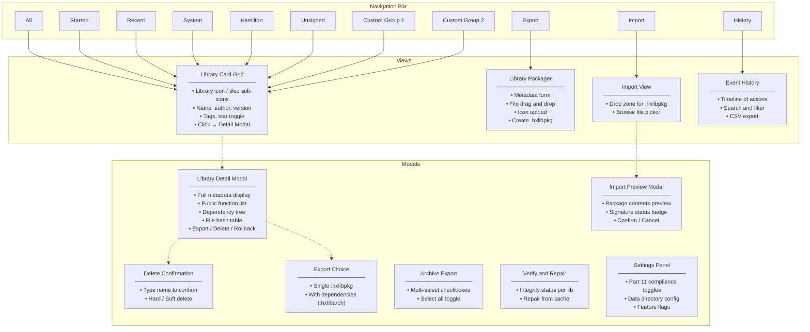

---

## 14. CLI Command Map

```mermaid
graph TD
    CLI_ENTRY["node cli.js command options"]

    CLI_ENTRY --> LIST_LIBS["list-libs<br/>─────────────────<br/>--include-deleted<br/>--json"]
    CLI_ENTRY --> IMPORT_LIB["import-lib<br/>─────────────────<br/>--file (required)<br/>--lib-dir  --met-dir<br/>--force  --no-group  --no-cache<br/>--author-password"]
    CLI_ENTRY --> IMPORT_ARCH["import-archive<br/>─────────────────<br/>--file (required)<br/>--lib-dir  --met-dir<br/>--force  --no-group  --no-cache<br/>--author-password"]
    CLI_ENTRY --> EXPORT_LIB["export-lib<br/>─────────────────<br/>--name / --id (required)<br/>--output (required)"]
    CLI_ENTRY --> EXPORT_ARCH["export-archive<br/>─────────────────<br/>--all / --names / --ids<br/>--output (required)"]
    CLI_ENTRY --> DELETE["delete-lib<br/>─────────────────<br/>--name / --id (required)<br/>--yes (required)<br/>--hard  --keep-files"]
    CLI_ENTRY --> CREATE_PKG["create-package<br/>─────────────────<br/>--spec (required)<br/>--output (required)<br/>--author-password"]
    CLI_ENTRY --> LIST_VER["list-versions<br/>─────────────────<br/>--name (required)<br/>--json"]
    CLI_ENTRY --> ROLLBACK["rollback-lib<br/>─────────────────<br/>--name (required)<br/>--version / --index<br/>--lib-dir  --met-dir"]
    CLI_ENTRY --> GEN_HASH["generate-syslib-hashes<br/>─────────────────<br/>--source-dir (required)<br/>--output"]
    CLI_ENTRY --> VER_HASH["verify-syslib-hashes<br/>─────────────────<br/>--hash-file  --lib-dir<br/>--json"]
    CLI_ENTRY --> VER_PKG["verify-package<br/>─────────────────<br/>--file (required)<br/>--json"]
    CLI_ENTRY --> HELP["help"]

    subgraph "Auth-Gated Commands"
        IMPORT_LIB
        IMPORT_ARCH
        DELETE
        ROLLBACK
    end

    style IMPORT_LIB fill:#2c5f8a,color:#fff
    style IMPORT_ARCH fill:#2c5f8a,color:#fff
    style DELETE fill:#8a2c2c,color:#fff
    style ROLLBACK fill:#8a6b2c,color:#fff
    style EXPORT_LIB fill:#2c8a3f,color:#fff
    style EXPORT_ARCH fill:#2c8a3f,color:#fff
    style CREATE_PKG fill:#5f2c8a,color:#fff
```
